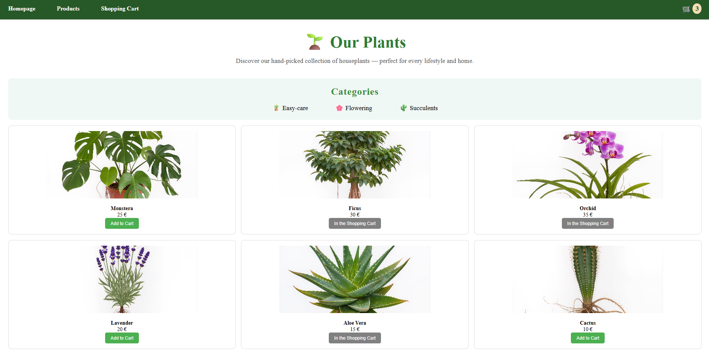
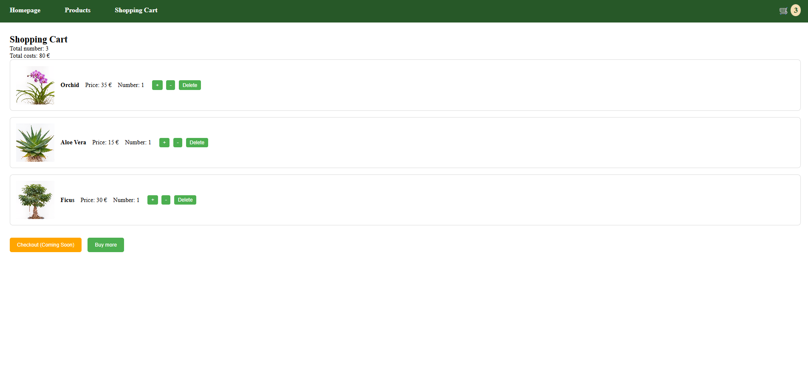

# 🌱 Planty Places – Houseplants Online Shopping Application

This is a **Plants Online Shopping Application** for a company called **Planty Places**.
This project is the final frontend assignment for the IBM course **Developing Front-End Apps with React** and simulates an online shop for houseplants. Users can browse plants, add them to a shopping cart, adjust quantities, and view a summary of their order. It's a responsive React + Redux frontend for a houseplant e-commerce experience, built with Vite.

---

## Screenshots

### Landing Page


### Product Listing Page



### Cart Page



---

## Project Overview

The application consists of three main pages, connected via React Router:

1. **Landing Page** (`/`)
   - Full-screen background image with an overlay
   - Company name (**Planty Places**) and short description
   - **"Get Started"** button that navigates to the product listing page

2. **Product Listing Page** (`/products`)
   - 6 hand-picked houseplants (Monstera, Ficus, Orchid, Lavender, Aloe Vera, Cactus), each with an `id`, `name`, `price`, `category` and `image`, defined in `src/data/plantsData.js`
   - A static category overview (🪴 Easy-care, 🌸 Flowering, 🌵 Succulents) — each plant carries a `category` field, though the UI does not yet filter by it
   - Each plant card displays:
     - Thumbnail image
     - Plant name
     - Price (in €)
     - **Add to Cart** button that dispatches the `addItem` Redux action; the button is disabled and its label changes to "In the Shopping Cart" once that plant is already in the cart

3. **Shopping Cart Page** (`/cart`)
   - Displays all items currently in the cart, read from the Redux store
   - Shows for each item: thumbnail, name, unit price, and quantity
   - Shows the overall total quantity and total cost
   - Features:
     - **+ / −** buttons to increase (`addItem`) or decrease (`removeItem`) the quantity of an item (an item is automatically removed once its quantity reaches 0)
     - **Delete** button to remove a plant entirely from the cart, regardless of quantity (`deleteItem`)
     - **Buy more** button linking back to the product listing page
     - **Checkout** button (currently a placeholder, labeled "Coming Soon")

A persistent **Header** (with navigation links and a live cart-item counter fed from the Redux store) is rendered on both the Product Listing and Cart pages.

---

## Technologies / Tech Stack

This project was built using the following technologies:

- **React 19** – Component-based UI library for building the application interface
- **Vite** – Fast development server and build tool
- **Redux Toolkit** (`@reduxjs/toolkit`, `react-redux`) – Centralized state management for the shopping cart (`items`, `totalQuantity`, `totalPrice`)
- **React Router 7** (`react-router-dom`) – Client-side routing between Landing, Product Listing, and Cart pages
- **JavaScript (ES6+)** – Core programming language
- **HTML5 & CSS3** – Structure and styling, including responsive design
- **ESLint** – Code linting (`eslint.config.js`)
- **Git & GitHub** – Version control

---

## State Management (Redux)

The cart state lives in a single Redux slice, `src/redux/cartSlice.js`, registered in `src/redux/store.js`:

- **State shape**: `{ items: [], totalQuantity: 0, totalPrice: 0 }`, where each item in `items` is `{ id, name, price, image, category, quantity }`
- **`addItem(plant)`** – adds a new plant to `items` with `quantity: 1`, or increments `quantity` if it's already in the cart; increases `totalQuantity` by 1 and `totalPrice` by the plant's price
- **`removeItem(id)`** – decrements the quantity of the given item by 1 (adjusting `totalQuantity`/`totalPrice` accordingly); removes the item from `items` entirely once its quantity reaches 0
- **`deleteItem(id)`** – removes the given item from `items` completely, regardless of its current quantity, and subtracts its full contribution from `totalQuantity`/`totalPrice`

`Header.jsx` and `CartPage.jsx` read from this slice via `useSelector`; `ProductListingPage.jsx` and `CartPage.jsx` dispatch actions via `useDispatch`.

---

## Quick Start

1. **Clone repository:**
   ```bash
   git clone https://github.com/source-code-examples/houseplants-shop.git
   cd houseplants-shop
   ```
2. **Install dependencies:**
   ```bash
   npm install
   ```
3. **Run locally (development server):**
   ```bash
   npm run dev
   ```
4. **Build for production:**
   ```bash
   npm run build
   ```
5. **Preview the production build locally:**
   ```bash
   npm run preview
   ```
6. **Lint the code:**
   ```bash
   npm run lint
   ```
7. Open the app: http://localhost:5173/houseplants-shop/

> Note: The app is configured with `basename="/houseplants-shop"` (see `src/App.jsx`), matching the GitHub Pages deployment path, so routes are served under `/houseplants-shop/...` both locally and in production.

---

## Available Scripts

| Command           | Description                                                       |
| ----------------- | ----------------------------------------------------------------- |
| `npm run dev`     | Starts the Vite development server with hot module reloading      |
| `npm run build`   | Builds the app for production into the `dist/` folder             |
| `npm run preview` | Serves the production build locally for a quick sanity check      |
| `npm run lint`    | Runs ESLint across the project                                    |
| `npm run deploy`  | Builds the app and publishes `dist/` to GitHub Pages (`gh-pages`) |

---

## Project Structure

```bash
houseplants-shop/
├── docs/
│   └── screenshots/          # README screenshots (landing, product, cart pages)
├── public/
│   └── images/                # Background image for the landing page
├── src/
│   ├── assets/                 # Plant thumbnail images (monstera, ficus, orchid, lavender, aloe-vera, cactus)
│   ├── components/
│   │   └── Header/              # Navigation + live cart-item counter
│   ├── data/
│   │   └── plantsData.js        # Static catalog of 6 plants (id, name, price, category, image)
│   ├── pages/
│   │   ├── LandingPage/          # "/" — hero section with "Get Started" button
│   │   ├── ProductListingPage/   # "/products" — plant grid with "Add to Cart"
│   │   └── CartPage/              # "/cart" — cart items, quantity controls, checkout placeholder
│   ├── redux/
│   │   ├── store.js               # Redux store configuration
│   │   └── cartSlice.js           # Cart state + addItem / removeItem / deleteItem reducers
│   ├── App.jsx                     # Root component defining all routes
│   ├── main.jsx                    # Application entry point (mounts <App /> with Redux <Provider>)
│   ├── App.css / index.css          # Global styles
│   └── ...
├── index.html                       # Vite HTML entry point
├── vite.config.js                   # Vite configuration
├── eslint.config.js                 # ESLint configuration
├── package.json
└── README.md
```

---

## Potential Roadmap

- Implement category filtering on the Product Listing Page (categories are already defined in `plantsData.js`, but the UI does not yet filter by them)
- Implement a real checkout flow (currently a "Coming Soon" placeholder button)
- Persist the cart across page reloads/sessions (currently held only in in-memory Redux state)
- Add form validation and a payment step for an actual purchase flow
